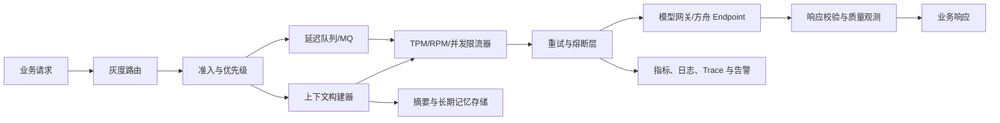

# 模型上量实践指导手册

<callout emoji="📌" background-color="light-blue" border-color="blue">
**适用范围**：通过火山方舟或兼容模型网关调用 LLM/VLM 的在线、准实时与离线业务。

**文档目标**：控制模型流量增长、重试放大和上下文膨胀，完成可观测、可暂停、可回滚的模型上量。

**使用说明**：“平台规则”来自参考资料；“建议默认值”需结合业务 SLO、模型配额和压测结果校准。
</callout>

<grid>
  <column width-ratio="0.33">
    <callout emoji="🚦" background-color="light-green" border-color="green">
**流量爬坡**

四维控流 · 分阶段灰度 · 指标驱动升降速
    </callout>
  </column>
  <column width-ratio="0.34">
    <callout emoji="🔁" background-color="light-yellow" border-color="yellow">
**重试治理**

错误白名单 · Full Jitter · 重试预算与熔断
    </callout>
  </column>
  <column width-ratio="0.33">
    <callout emoji="🧠" background-color="light-purple" border-color="purple">
**上下文管理**

分层预算 · 结构化压缩 · 有损截断兜底
    </callout>
  </column>
</grid>

## 1. 🧭 核心结论

1. **四维控流**：上量必须同时控制 `TPM`、`RPM`、在途并发和业务灰度比例，不能只控制 QPS。
2. **主动爬坡**：冷启动或恢复流量时应主动爬坡。较前一分钟增加约 300 万 TPM，或 3 分钟内增长约 20%，可能被识别为突发流量；实际判定会随资源水位动态变化。
3. **斜率约束**：客户端建议将流量增长斜率控制在每分钟 200 万至 300 万 TPM 以内。对 TTFT 敏感的在线业务，优先采用更保守的曲线，例如至少用 5 分钟上量到 600 万 TPM。
4. **精确重试**：方舟场景默认仅对 `429 + ServerOverloaded` 和 `429 + RequestBurstTooFast` 做退避重试。参数错误、鉴权错误、内容超限和 VLM 素材不合法不能重试。
5. **统一治理**：所有重试必须重新经过统一限流器，并受重试次数、总时长和重试流量预算约束，避免重试风暴。
6. **上下文分层**：采用“固定指令 + 近期对话 + 滚动摘要 + 按需检索”的结构。先压缩再截断，截断时必须保留系统约束、当前用户意图、未完成工具调用和关键业务状态。
7. **门禁晋级**：只有成功率、延时、质量、成本和上下文健康度全部通过门禁，才允许进入下一流量阶段。

---

## 2. 📐 平台事实与使用边界

### 2.1 已确认的平台规则

| 项目 | 平台规则或参考值 | 实践解释 |
|---|---|---|
| 通用默认限流参考 | RPM 30,000；TPM 500 万 | 仅作常见参考，实际上线前必须查询目标模型和 Endpoint 的当前限流 |
| 突发流量参考判定 | 较前一分钟增加约 300 万 TPM，或 3 分钟内增长约 20% | 判定阈值会按实际水位和承载力动态调整，不能将阈值视为容量承诺 |
| 推荐爬坡斜率 | 每分钟增加 200 万至 300 万 TPM | 在线业务宜进一步收紧；不可通过同模型多 Endpoint 或多账号规避 |
| 突发流量响应 | HTTP 429，错误码为 `ServerOverloaded` 或 `RequestBurstTooFast` | 服务扩容通常需要分钟级时间，客户端应降速而不是高频重试 |
| 服务端排队 | `X-Ark-Max-Wait-Timeout-Ms` 建议为 60,000 至 600,000 毫秒 | 适合非强实时请求；客户端总超时必须覆盖排队时间 |
| VLM 输入限制示例 | 单视频超过 50 MB，或单请求视频超过 10 个会返回 400 | 属于请求参数错误，应修改输入，禁止自动重试 |

### 2.2 关键边界

- 模型限流通常按“同主账号、同模型”聚合，不区分模型版本。
- 同模型多 Endpoint 或多账号分流不能消除底层资源池瓶颈。
- 跨模型分流才可能利用独立资源池，但必须提前验证质量、价格、上下文窗口和输出格式兼容性。
- 限流值是单位时间上限，不是服务容量保障。接近配额运行时仍需要预留波动空间。
- 本文建议默认使用 80% 配额作为稳定容量上限，剩余 20% 用于流量抖动、重试和估算误差。

<callout emoji="❗" background-color="light-yellow" border-color="yellow">
**容量边界**：突发判定阈值会随平台资源水位动态变化。限流值是上限，不是容量承诺；正式上量必须预留至少 20% 的安全余量。
</callout>

---

## 3. 🎯 上量目标与发布门禁

### 3.1 建议 SLO

以下为上线起始值，业务负责人应在评审时确认最终目标。

| 维度 | 在线交互业务 | 离线/批量业务 |
|---|---|---|
| 请求成功率 | >= 99.5% | >= 99.0% |
| 突发限流错误率 | < 0.1% | < 0.5% |
| 总重试放大系数 | <= 1.10 | <= 1.20 |
| P95 TTFT 增幅 | 相比基线 <= 20% | 不作为主门禁 |
| P95 端到端时延增幅 | 相比基线 <= 20% | 在任务 SLA 内 |
| 上下文压缩失败率 | < 0.1% | < 0.1% |
| 非预期截断率 | < 0.05% | < 0.1% |
| 质量回归 | 核心评测集不下降 | 核心评测集不下降 |
| 单任务成本增幅 | 在预算内 | 在预算内 |

### 3.2 双层上量

模型上量包含两个相互独立的控制面：

1. **业务灰度控制**：决定多少真实用户或任务进入新模型。
2. **模型负载控制**：决定模型端每分钟可以接收多少 Token、请求和并发。

业务灰度提升不代表模型负载可以同步跳升。每次提升灰度前，必须确认模型负载控制器仍有余量。

### 3.3 推荐阶段

| 阶段 | 流量 | 最短观察时间 | 主要目标 | 晋级条件 |
|---|---|---|---|---|
| 离线评测 | 0% | 完整评测周期 | 质量、格式、上下文边界 | 核心集通过，无阻断问题 |
| 影子流量 | 0% 用户可见 | 30 分钟 | 容量、延时、成本 | 不影响主链路，指标稳定 |
| 金丝雀 | 1% | 30 分钟 | 小流量真实闭环 | 全部 SLO 通过 |
| 小流量 | 5% | 30 分钟 | 验证错误分布 | 全部 SLO 通过 |
| 扩大灰度 | 10% / 25% | 每档 30 至 60 分钟 | 验证容量曲线 | 无持续黄灯或红灯 |
| 半量 | 50% | 60 分钟 | 验证峰值与降级 | 峰值窗口通过 |
| 全量 | 100% | 一个完整业务周期 | 稳态运行 | 持续监控并保留回滚能力 |

流量低于统计显著性要求时，应延长观察时间，不能因“暂时没有报错”提前晋级。

---

## 4. 🏗️ 总体架构



关键职责如下：

- **灰度路由**：按用户、租户、任务类型做稳定哈希，保证同一会话尽量固定模型。
- **准入与优先级**：核心在线请求优先；低优离线任务可排队、拒绝或延迟。
- **上下文构建器**：在调用前完成预算、检索、压缩和截断，不把超限错误交给模型端处理。
- **统一限流器**：所有首次请求和重试共享同一套 TPM、RPM、并发令牌。
- **重试与熔断层**：执行错误分类、退避、重试预算和快速降载。
- **观测层**：使用统一 `request_id`、`conversation_id` 和 `attempt_id` 串联每次原始请求及其重试。

---

## 5. 🧮 上量前容量评估

### 5.1 建立请求画像

至少使用最近 7 天数据，按业务场景分别统计：

- 输入 Token：P50、P95、P99。
- 输出 Token：P50、P95、P99。
- 每请求总 Token：输入与输出之和。
- TTFT、生成时长和端到端时延。
- 流式与非流式请求占比。
- 文本、图片、视频等不同输入类型的请求占比。
- 高峰 RPM、TPM、在途并发和增长斜率。
- 会话轮数、上下文压缩率、截断率。
- 可重试错误、不可重试错误和客户端取消的分布。

平均值不能用于容量保护。限流和超时设计至少使用 P95，关键业务使用 P99。

### 5.2 计算稳定 QPS 上限

```text
effective_rpm      = model_rpm_limit * utilization
effective_tpm      = model_tpm_limit * utilization
qps_by_rpm         = effective_rpm / 60
qps_by_tpm         = effective_tpm / (60 * p95_total_tokens_per_request)
qps_by_concurrency = inflight_limit / p95_request_latency_seconds
stable_qps_cap     = min(qps_by_rpm, qps_by_tpm, qps_by_concurrency)
```

其中 `utilization` 建议初始取 `0.8`。

示例：若限流为 RPM 30,000、TPM 500 万，P95 每请求 2,500 Token，P95 时延 8 秒，在途上限 1,000：

```text
qps_by_rpm         = 30,000 * 0.8 / 60 = 400
qps_by_tpm         = 5,000,000 * 0.8 / 60 / 2,500 = 26.7
qps_by_concurrency = 1,000 / 8 = 125
stable_qps_cap     = 26.7
```

<callout emoji="✅" background-color="light-green" border-color="green">
**计算结论**：此时稳定 QPS 上限为 **26.7**，瓶颈是 TPM。若只按 RPM 或 QPS 放量，会提前触发 Token 限流。
</callout>

### 5.3 上量前检查

- 已确认目标模型、版本、Endpoint、区域和实际配额。
- 已完成代表真实分布的压测，压测包含长上下文、大输出和 VLM 大素材。
- 已配置首次请求与重试共享的限流器。
- 已验证跨模型降级的质量、参数和输出 Schema。
- 已准备暂停、降速、回滚和关闭重试的动态开关。
- 已为离线任务准备 MQ 或延迟队列，消息具备过期时间、最大重试次数和死信队列。
- 已建立业务、平台和客户端三类错误码映射。
- 已完成仪表盘、告警、值班人和变更窗口确认。

---

## 6. 🚦 模型调用爬坡优化方案

### 6.1 四维限流

每个模型路由至少配置四类限制：

| 限制 | 作用 | 实现建议 |
|---|---|---|
| TPM | 控制真实计算负载 | 根据输入 Token 精确计数，输出 Token 先预占、结束后结算 |
| RPM | 控制请求频率 | 令牌桶或滑动窗口 |
| 在途并发 | 控制排队和内存占用 | 信号量，按模型和优先级隔离 |
| 增长斜率 | 控制冷启动和恢复速度 | 按 1 分钟及滚动 3 分钟窗口计算 |

输出 Token 预占建议使用：

```text
output_reserve = min(max_output_tokens, historical_p95_output_tokens * 1.2)
reserved_tokens = input_tokens + max(business_min_output_reserve, output_reserve)
```

关键业务或输出分布不稳定时，直接按 `max_output_tokens` 预占。请求完成后，按实际使用量归还多余 Token。不能等响应结束后才计入 TPM，否则并发高时会严重低估负载。

### 6.2 爬坡曲线

#### 在线实时业务

1. 从目标稳定容量的 5% 至 10% 启动，或从最近稳定基线恢复。
2. 每 30 至 60 秒评估一次，指标为绿灯时提升 5% 至 10%。
3. 冷启动阶段每分钟绝对增量不得超过 200 万 TPM；对 TTFT 敏感业务建议按约 120 万 TPM/分钟控制。
4. 形成稳定基线后，同时控制滚动 3 分钟增幅不超过 20%。
5. 出现黄灯时保持当前速率；出现红灯时立即下降 30% 至 50%，并冻结至少 3 分钟。

#### 离线批量业务

1. 请求先进入 MQ，不允许生产者直接并发打向模型。
2. 消费速率从稳定容量的 5% 启动，按固定周期小步增长。
3. 队列消费者必须支持延迟重投，禁止失败后立即 `nack + requeue` 形成忙循环。
4. 当预计完成时间无法满足任务 SLA 时，应提前扩容、购买保障资源或启用跨模型分流，不能提高斜率硬冲。

#### 客户端无法改造

适合输入输出 Token 比较稳定、时延不敏感的离线业务，可申请服务端强制爬坡。服务端整形期间 TTFT 可能明显升高，客户端超时必须覆盖整形时间。

### 6.3 自适应控制器

使用加性增速、乘性降速的 AIMD 思路：

```text
每个评估周期：
  若样本量不足：
      保持当前速率
  若突发限流率 >= red_threshold 或 P95_TTFT > baseline * 1.5：
      rate = max(min_rate, rate * 0.5)
      freeze = 3 分钟
  若突发限流率 >= yellow_threshold 或 P95_TTFT > baseline * 1.2：
      保持当前速率
  若成功率、延时、队列年龄均为绿灯：
      rate = min(target_rate, rate * 1.05)
  最终结果继续受 TPM、RPM、并发和增长斜率硬上限约束
```

建议起始阈值：

| 指标 | 绿灯 | 黄灯 | 红灯 |
|---|---|---|---|
| `ServerOverloaded/RequestBurstTooFast` 错误率 | < 0.1% | 0.1% 至 1% | >= 1% |
| 总请求成功率 | >= 99.5% | 99% 至 99.5% | < 99% |
| P95 TTFT / 基线 | <= 1.2 | 1.2 至 1.5 | > 1.5 |
| 重试放大系数 | <= 1.10 | 1.10 至 1.20 | > 1.20 |
| 最老队列等待时间 | < SLA 的 50% | SLA 的 50% 至 80% | > SLA 的 80% |

方舟官方 QPS Climber 示例使用 `1%` 和 `5%` 作为保持与降速错误率阈值，并以 `5%`/`10%` 步长探测。生产环境应根据业务 SLO 收紧，不能直接照搬。

### 6.4 削峰、排队与分流

#### 客户端削峰

- 在线请求只允许短队列，超过排队预算后快速降级或失败，避免排队耗尽端到端超时。
- 离线请求使用持久化 MQ，消息包含 `request_id`、优先级、过期时间、尝试次数和业务幂等键。
- 消费者按“优先级 + 截止时间”调度，防止低优先级大任务阻塞核心流量。
- 队列积压超过可恢复范围时停止接收低优先级任务，而不是无限堆积。

#### 服务端排队

对允许分钟级等待的请求，可设置：

```http
X-Ark-Max-Wait-Timeout-Ms: 300000
```

超时关系：

```text
非流式客户端超时 >= 基础模型超时 + 服务端最大排队时间 + 网络余量
流式首包超时     >  服务端最大排队时间
```

客户端排队和服务端排队不应同时配置为最大值，否则总时延和资源占用难以控制。

#### 跨模型分流

只有满足以下条件才允许自动分流：

- 备用模型使用独立资源池。
- 质量评测达到业务门槛。
- 上下文窗口、工具调用、结构化输出和安全策略兼容。
- 成本和数据合规已评审。
- 会话粘性策略明确，避免同一会话频繁切换模型导致语义漂移。

### 6.5 暂停与回滚

出现任一条件时停止晋级：

- 连续 3 个评估窗口为黄灯。
- 任意 1 个评估窗口为红灯。
- 核心业务指标或质量评测显著下降。
- 上下文截断、输出解析或工具调用错误显著增加。
- 供应商公告故障或监控数据不可用。

出现以下情况立即回滚至上一稳定档位：

- 成功率低于 99% 持续 2 分钟。
- 突发限流错误率达到 1%。
- P95 TTFT 超过基线 1.5 倍。
- 重试放大系数超过 1.2。
- 出现数据串租户、错误工具执行或高风险内容安全事件。

---

## 7. 🔁 模型重试方案

<callout emoji="❌" background-color="light-red" border-color="red">
**默认拒绝原则**：未知错误不重试。方舟默认只允许重试两个明确的 429 错误码；参数、鉴权、内容安全和原样上下文超限请求必须直接终止。
</callout>

### 7.1 原则

1. 先分类，再重试；未知错误默认不重试。
2. 重试是恢复手段，不是容量补偿手段。
3. 每次重试都必须重新经过上下文预算、限流器和熔断器。
4. 统计错误率时同时记录原始请求数和总尝试数，不能用重试后的成功掩盖首次成功率下降。
5. 客户端取消、业务截止时间到期或剩余时间不足时立即停止重试。

### 7.2 错误决策矩阵

| 场景 | 默认策略 | 说明 |
|---|---|---|
| `429 + ServerOverloaded` | 退避后重试并降低爬坡速率 | 适用于较早模型版本的突发流量保护 |
| `429 + RequestBurstTooFast` | 退避后重试并降低爬坡速率 | 适用于较新模型版本的突发流量保护 |
| HTTP 429 但错误码未知 | 不自动重试 | 先更新错误码注册表，避免掩盖配额或账户问题 |
| 建连失败且确认请求未发出 | 最多立即重试 1 次 | 仍受总重试预算约束 |
| 连接超时、读超时、连接重置 | 仅幂等请求可重试 | 服务端可能已经执行，需防止重复计费或重复副作用 |
| 500/502/503/504 | 方舟默认不加入允许列表 | 仅在供应商文档明确允许且业务幂等时按 Provider 单独开启 |
| 400 / `InvalidParameter` | 不重试 | 修复参数；包括 VLM 视频过大、数量超限 |
| 上下文长度超限 | 不原样重试 | 进入上下文压缩流程，生成新请求后才可再次调用 |
| 401/403 | 不重试 | 检查密钥、权限和租户配置 |
| 404 / 模型或 Endpoint 不存在 | 不重试 | 配置错误或资源已下线 |
| 内容安全拒绝 | 不重试 | 按业务策略提示、改写或转人工 |
| JSON/Schema 输出不合法 | 最多修复调用 1 次 | 使用明确的修复提示，并计入新的模型调用和成本 |
| 流式输出已返回部分内容后中断 | 不盲目自动重试 | 避免重复内容；由业务选择重新生成或向用户提示不完整 |
| 工具调用已产生外部副作用 | 不自动重试工具 | 必须使用业务幂等键查询执行状态 |

方舟适配器的默认允许列表应保持为：

```yaml
retryable_errors:
  - http_status: 429
    error_code: ServerOverloaded
  - http_status: 429
    error_code: RequestBurstTooFast
```

### 7.3 三类重试方式

#### 立即重试

仅用于确认请求未发送成功的本地瞬时故障，例如连接池取连接失败。最多 1 次，不适用于已收到 HTTP 响应的请求。

#### 固定间隔重试

仅在服务端返回可信的 `Retry-After` 时使用，以服务端值为准并叠加少量随机抖动。没有 `Retry-After` 时不使用固定间隔。

#### 随机指数退避

默认公式使用 Full Jitter：

```text
max_delay_n = min(cap_delay, base_delay * 2^n)
actual_delay_n = random(0, max_delay_n)
```

建议默认值：

| 参数 | 在线请求 | 离线请求 |
|---|---|---|
| 基础等待 | 500 ms | 1 s |
| 最大单次等待 | 8 s | 60 s |
| 最大重试次数 | 2 次 | 5 次 |
| 最大重试总时长 | 8 s | 10 min |
| 重试流量预算 | 原始请求的 10% | 原始请求的 20% |

最大重试次数不包含首次请求。业务剩余时间不足以覆盖下一次等待和一次模型调用时，应提前终止。

### 7.4 重试预算与放大控制

```text
retry_amplification = total_attempts / original_requests
retry_budget_usage  = retry_attempts / original_requests
```

控制规则：

- 在线流量的 `retry_amplification` 超过 1.10 时停止低优先级重试。
- 超过 1.20 时打开模型侧熔断，回退到上一稳定流量或备用模型。
- 重试令牌从独立预算桶扣除，但发送前仍必须通过模型总限流桶。
- 同一业务请求的并发重试必须合并，使用 singleflight 或分布式锁避免多个实例同时重试。
- 已成功完成的 `business_request_id` 应短期缓存结果，重复请求直接返回缓存。

### 7.5 熔断器

按“模型 + Endpoint + 错误码”维护熔断状态：

| 状态 | 行为 |
|---|---|
| Closed | 正常请求和受控重试 |
| Open | 拒绝或降级非核心请求，不向故障模型继续施压 |
| Half-Open | 每个评估窗口仅放少量探测请求 |

建议以连续 3 个窗口错误率超阈值，或单窗口突发限流率达到 1% 作为打开条件。半开探测成功后应逐级恢复，不能直接回到熔断前流量。

### 7.6 参考伪代码

```python
def invoke_with_retry(request, deadline):
    for attempt in range(MAX_ATTEMPTS):
        ensure_deadline_allows_next_attempt(deadline)
        reserve = estimate_token_reservation(request)

        # 首次调用和重试共用同一套限流及并发控制。
        with global_model_limiter.reserve(reserve):
            response, error = provider.invoke(request, attempt_id=attempt)

        metrics.record_attempt(request.id, attempt, response, error)
        if error is None:
            return response

        decision = retry_policy.classify(error, request)
        if not decision.retryable:
            raise error

        ramp_controller.record_overload(error)
        retry_budget.consume_or_raise(request.priority)
        sleep(full_jitter(attempt, decision.retry_after))

    raise RetryExhausted(request.id)
```

---

## 8. 🧠 上下文管理方案

<callout emoji="💡" background-color="light-blue" border-color="blue">
**处理顺序**：先做 Token 预算，再按需检索；达到 70% 开始压缩，达到 85% 强制压缩，达到 95% 才执行紧急截断。
</callout>

### 8.1 目标

上下文管理需要同时满足：

- 不超过模型上下文窗口。
- 保留当前任务所需的约束、状态和证据。
- 控制输入 Token、延时和成本。
- 避免摘要失真、工具状态断裂和跨租户信息泄漏。
- 允许会话在模型切换或服务重启后恢复。

### 8.2 Token 预算

```text
input_budget = context_window
             - reserved_output_tokens
             - protocol_overhead
             - safety_margin
```

建议：

- `reserved_output_tokens` 默认使用“历史 P95 输出的 1.2 倍”和配置最大输出中的较小值，且不能低于业务最低完整输出；关键业务直接使用配置最大输出。
- `protocol_overhead` 覆盖消息角色、工具 Schema、多模态元信息等不可见开销。
- `safety_margin` 取上下文窗口的 5%，且不少于 1,024 Token。
- 预算计算使用与生产模型一致的 tokenizer；无法精确计数时使用保守估算并扩大安全边界。

输入预算的建议分配：

| 分层 | 建议占输入预算 | 内容 |
|---|---|---|
| 固定指令 | 10% | 系统规则、安全策略、输出契约 |
| 工具定义与工作状态 | 15% | 工具 Schema、未完成调用、关键执行状态 |
| 近期对话 | 35% | 当前用户消息和最近若干轮原文 |
| 滚动摘要 | 15% | 历史目标、决策、约束和未决事项 |
| 检索内容 | 20% | 与当前问题相关的知识和证据 |
| 机动空间 | 5% | Token 估算误差和临时补充 |

该比例是上限而非必须填满。没有相关内容时应留空，不能为了“利用窗口”塞入无关材料。

### 8.3 分层上下文

1. **L0 固定控制层**：系统指令、安全策略、租户策略、输出 Schema。版本化管理，不参与自动摘要。
2. **L1 工作记忆层**：当前用户意图、最近对话、未完成工具调用、临时变量。保持原文。
3. **L2 会话摘要层**：被移出工作记忆的历史内容，以结构化摘要保存。
4. **L3 检索记忆层**：长期事实、文档片段、历史任务结果。按需检索，不默认注入。
5. **L4 外部工件层**：大文件、完整工具输出、日志和媒体，仅在上下文中保留引用、摘要和校验值。

### 8.4 压缩触发与目标

| 水位 | 动作 |
|---|---|
| 输入预算使用率 < 70% | 正常构建上下文 |
| 70% 至 85% | 异步或同步更新滚动摘要，将使用率压回 55% 至 65% |
| 85% 至 95% | 强制压缩工具结果、检索材料和最旧对话 |
| >= 95% | 执行紧急截断；仍无法满足预算则拒绝调用并要求拆分任务或新建会话 |

压缩对象的优先顺序：

1. 重复检索片段和低相关知识。
2. 已完成工具调用的冗长原始输出。
3. 已被可靠摘要覆盖的旧对话。
4. 与当前任务无关的支线讨论。

禁止自动压缩：

- 系统和安全规则。
- 当前用户消息。
- 未完成工具调用及其参数。
- 业务明确要求逐字保留的内容。
- 影响法律、财务、权限或外部副作用的原始指令。

### 8.5 结构化摘要

滚动摘要应使用固定 Schema，避免生成散文式概括：

```yaml
summary_version: 3
source_turn_range: [1, 42]
current_objective: "..."
user_constraints:
  - "..."
confirmed_facts:
  - fact: "..."
    source_turn: 12
decisions:
  - decision: "..."
    reason: "..."
open_questions:
  - "..."
tool_state:
  completed:
    - tool: "..."
      result_ref: "artifact://..."
  pending:
    - tool: "..."
      arguments: {}
artifacts:
  - uri: "..."
    digest: "..."
next_action: "..."
```

更新摘要时只使用“上一版摘要 + 本轮即将移出的原始消息”，并保留来源轮次。摘要生成后执行以下校验：

- 当前目标、用户硬约束和未决事项没有丢失。
- 数字、单位、ID、时间和否定词与原文一致。
- 工具调用和工具结果成对保留。
- 推断与已确认事实分开。
- 新摘要 Token 数低于被替换内容的 40%，否则不接受该摘要。

### 8.6 截断策略

截断采用明确优先级，而不是简单删除最早消息：

```text
必须保留：
  系统规则
  当前用户消息
  当前任务计划和关键约束
  未完成工具调用及对应结果
  最近必要对话

优先删除：
  重复检索结果
  已完成工具的详细日志
  已有摘要覆盖的旧消息
  低相关示例和寒暄
```

工具调用消息与工具结果消息必须成对保留或成对移除。只保留一侧会导致模型误判执行状态。

### 8.7 检索上下文

- 检索前先生成当前任务查询，不直接使用整段对话作为查询。
- 同一来源的相邻片段先合并再去重，避免重复占用 Token。
- 每个片段携带来源、时间、权限和可信度。
- 检索内容视为不可信数据，不能覆盖系统指令或触发未授权工具调用。
- Top-K 由 Token 预算决定，不使用固定 K 强行填满窗口。
- 事实冲突时同时保留冲突来源并显式标注，不自动拼接成一个结论。

### 8.8 工具结果与多模态内容

- 大型 JSON、日志和表格保存到外部工件存储，上下文仅保留字段级摘要与 URI。
- 工具输出摘要必须保留错误码、状态、关键数字和下一步所需字段。
- 图片、视频和音频在发送前校验大小、数量、格式和可访问性。
- VLM 输入不满足平台约束时在客户端直接拒绝，禁止通过重试消耗下载带宽。
- 对可能产生副作用的工具调用，保存幂等键、请求摘要和最终状态。

### 8.9 缓存与会话粘性

- 稳定的系统提示和工具定义保持固定顺序，以提高前缀缓存命中率。
- 不把时间戳、随机 ID 等高变化字段放在固定前缀中。
- 响应缓存键至少包含模型版本、提示模板版本、输入摘要和安全策略版本。
- 同一会话优先固定模型；切换模型时重新检查上下文窗口和 tokenizer。
- 长期记忆按租户隔离，设置 TTL、删除机制和访问审计。

---

## 9. 📊 监控与告警

### 9.1 必须采集的指标

#### 流量与容量

- 请求 QPS、RPM、输入 TPM、输出 TPM、总 TPM。
- 1 分钟 TPM 增量、滚动 3 分钟增长率。
- 在途请求、客户端队列长度、最老消息等待时间。
- 各模型、Endpoint、业务、租户和优先级的流量占比。

#### 稳定性

- 首次请求成功率、最终成功率。
- `ServerOverloaded`、`RequestBurstTooFast` 和其他错误码占比。
- 重试次数分布、重试成功率、重试放大系数。
- 熔断状态、半开探测结果、降级和回滚次数。

#### 时延

- TTFT P50/P95/P99。
- 完整响应时延 P50/P95/P99。
- 客户端排队、服务端排队、模型推理和后处理分段时延。

#### 上下文

- 输入/输出 Token P50/P95/P99。
- 上下文预算使用率。
- 压缩触发率、压缩前后 Token 比、摘要校验失败率。
- 截断率、上下文超限率、输出因预算不足被截断的比例。
- 检索 Token 占比、缓存命中率。

#### 质量与成本

- 核心任务成功率、Schema 合法率、工具调用成功率。
- 人工反馈、拒答率和安全拦截率。
- 单请求和单成功任务成本。
- 首次失败但重试成功所增加的 Token 与费用。

### 9.2 建议告警

| 告警 | 条件 | 动作 |
|---|---|---|
| 突发限流黄灯 | 429 目标错误码 >= 0.1%，持续 2 分钟 | 暂停爬坡 |
| 突发限流红灯 | 429 目标错误码 >= 1%，持续 1 分钟 | 降速 50%，评估回滚 |
| 重试放大 | 在线 > 1.10 | 停止低优先级重试 |
| TTFT 退化 | P95 > 基线 1.5 倍 | 暂停爬坡并检查排队 |
| 上下文风险 | P95 预算使用率 > 85% | 检查压缩和检索预算 |
| 摘要异常 | 摘要校验失败率 >= 0.1% | 回退到原始上下文并降级 |
| 队列过期风险 | 最老等待时间 > SLA 的 80% | 停止接入低优任务 |
| 质量回归 | 核心指标低于发布门槛 | 回滚模型或提示模板 |

平台告警、消息中心和业务侧告警应同时启用，避免单一监控面失效。

<callout emoji="❗" background-color="light-yellow" border-color="yellow">
**告警闭环**：告警必须能够触发暂停爬坡、降速或回滚动作。只有通知、没有处置责任人和动态开关的告警不构成上线保障。
</callout>

---

## 10. 🛠️ 上量执行 SOP

### 10.1 变更前

1. 冻结模型版本、Endpoint、提示模板、上下文策略和重试策略。
2. 记录当前稳定版本的质量、成功率、TTFT、Token 和成本基线。
3. 核对模型配额、容量计算和目标峰值。
4. 验证监控、告警、动态开关、熔断、降级和回滚。
5. 清空历史压测任务或将其与生产流量隔离。
6. 召开上量评审，明确操作人、观察人、业务决策人和供应商联系人。

### 10.2 变更中

1. 开启影子流量，验证真实 Token 和时延分布。
2. 进入 1% 金丝雀，启动模型负载爬坡器。
3. 每个评估窗口记录当前灰度、TPM、RPM、并发、错误率、TTFT、重试和上下文指标。
4. 绿灯达到阶段最短观察时间后才能晋级。
5. 黄灯保持当前档位并定位原因；红灯立即降速或回滚。
6. 任何人工覆盖控制器的操作都必须记录原因、操作者和恢复时间。

### 10.3 变更后

1. 全量后至少观察一个完整业务峰值周期。
2. 保留上一模型和上一配置的快速回滚能力。
3. 汇总各阶段指标、故障、人工干预和实际容量瓶颈。
4. 将最终稳定阈值写入配置中心，不把实验参数遗留在代码常量中。
5. 更新错误码注册表、容量模型和上下文预算基线。

---

## 11. ⚠️ 常见失败模式

| 失败模式 | 结果 | 修复方式 |
|---|---|---|
| 只按 QPS 限流 | 长请求增加时突然打满 TPM | 同时控制 TPM、RPM、并发和斜率 |
| 重试绕过限流器 | 429 后产生更大流量峰值 | 所有尝试共享统一限流器 |
| 所有 4xx/5xx 都重试 | 无效请求反复计费并占用容量 | 使用 Provider 级错误允许列表 |
| MQ 失败后立即 requeue | 消费者忙循环，持续冲击模型 | 使用延迟队列和最大尝试次数 |
| 同模型多 Endpoint 分流 | 表面分流，底层资源仍然过载 | 使用跨模型独立资源池或提前扩容 |
| 只删除最早对话 | 丢失关键约束和工具状态 | 结构化摘要后按优先级截断 |
| 摘要覆盖系统规则 | 安全和输出约束漂移 | 固定控制层不参与摘要 |
| 工具调用与结果拆开 | 模型重复执行或误判状态 | 成对保留或成对移除 |
| 客户端和服务端都长时间排队 | 超时、连接和内存被占满 | 只保留一个主要排队层并计算总预算 |
| 流式响应中断后自动重放 | 用户收到重复或冲突内容 | 检测首 Token，部分输出后转业务决策 |

---

## 12. ⚙️ 配置基线

```yaml
rollout:
  utilization_target: 0.80
  evaluation_interval_seconds: 60
  increase_ratio: 0.05
  decrease_ratio: 0.50
  freeze_seconds_after_red: 180
  max_tpm_increase_per_minute: 2000000
  max_growth_ratio_per_3_minutes: 0.20
  stages: [0.01, 0.05, 0.10, 0.25, 0.50, 1.00]

guardrails:
  overload_error_yellow: 0.001
  overload_error_red: 0.01
  success_rate_min: 0.995
  p95_ttft_ratio_yellow: 1.20
  p95_ttft_ratio_red: 1.50
  retry_amplification_yellow: 1.10
  retry_amplification_red: 1.20

retry:
  max_attempts_online: 3
  max_attempts_offline: 6
  base_delay_ms: 500
  max_delay_ms_online: 8000
  max_delay_ms_offline: 60000
  online_retry_budget_ratio: 0.10
  offline_retry_budget_ratio: 0.20
  retryable_errors:
    - status: 429
      code: ServerOverloaded
    - status: 429
      code: RequestBurstTooFast

context:
  safety_margin_ratio: 0.05
  safety_margin_min_tokens: 1024
  compress_threshold: 0.70
  force_compress_threshold: 0.85
  emergency_truncate_threshold: 0.95
  target_after_compression_min: 0.55
  target_after_compression_max: 0.65
```

配置必须支持按模型、业务和优先级覆盖，并通过配置中心动态调整。每次变更需保留版本、审计记录和一键回滚能力。

---

## 13. ✅ 发布验收清单

### 🚦 流量与容量

- [ ] 已获取目标模型和 Endpoint 的实际 TPM、RPM、并发限流。
- [ ] 已使用 P95/P99 Token 和时延计算稳定容量。
- [ ] 已配置 TPM、RPM、并发和增长斜率四维限制。
- [ ] 已验证 1 分钟绝对增量和滚动 3 分钟增幅控制。
- [ ] 已验证暂停、降速、熔断和回滚。

### 🔁 重试

- [ ] 方舟默认只重试两个明确的 429 错误码。
- [ ] 参数、鉴权、上下文和内容安全错误不会自动重试。
- [ ] 重试使用 Full Jitter，并设置次数、时长和流量预算。
- [ ] 重试请求重新经过统一限流器。
- [ ] 流式部分响应和工具副作用场景已单独处理。
- [ ] 已监控首次成功率和重试放大系数。

### 🧠 上下文

- [ ] Token 计数器与生产模型一致或使用保守估算。
- [ ] 已预留输出、协议开销和安全边界。
- [ ] 已实现 70% 压缩、85% 强制压缩和 95% 紧急截断。
- [ ] 系统规则、当前用户消息和未完成工具调用不会被压缩删除。
- [ ] 滚动摘要采用结构化 Schema 并可追溯到原始轮次。
- [ ] 检索结果、长期记忆和缓存均按租户隔离。

### 📊 观测与治理

- [ ] 指标覆盖流量、稳定性、时延、上下文、质量和成本。
- [ ] 平台消息订阅、业务告警和联系人均已配置。
- [ ] 灰度分组稳定，同一会话具备模型粘性。
- [ ] 全量后观察至少一个完整峰值周期。
- [ ] 上量记录和复盘已归档。

---

## 14. 📚 参考资料

- 飞书主文档：[模型上量-实践指导手册](https://bytedance.larkoffice.com/docx/VaExdqvAzonktZxgxoCcrLU3nGd)
- 飞书关联规范：`【LLM/VLM】豆包大语言模型上量规范`
- 火山方舟：[处理突发流量最佳实践](https://docs.volcengine.com/docs/82379/1848593?lang=zh)
- 火山方舟：[模型列表与限流信息](https://docs.volcengine.com/docs/82379/1330310)
- 火山方舟：[推理错误码](https://docs.volcengine.com/docs/82379/1299023)

<callout emoji="📝" background-color="light-gray" border-color="gray">
平台阈值、模型版本、错误码和限流值可能调整。每次正式上量前，应以当前控制台、官方文档和客户成功经理确认结果为准。
</callout>
